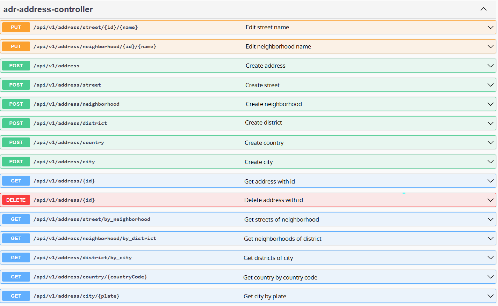

# Odev 2 teslim tarihi : 13 Haziran 23:00 

## Screenshot file: Swagger.png
## Implementation files: hwtwo folder

Not: district/by city, neighborhood/by_district, ve street/by_neighborhood requestlerim sebebini bilmediğim bir şekilde swaggerda error veriyor, ancak postmande denediğimde bütün requestlerim sorunsuz çalışıyor. Bu üç request in postman ekran görüntülerini de repoda bulabilirsiniz.

